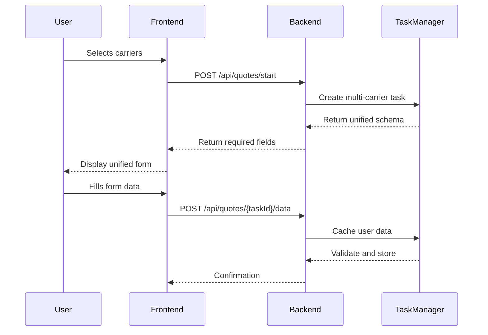
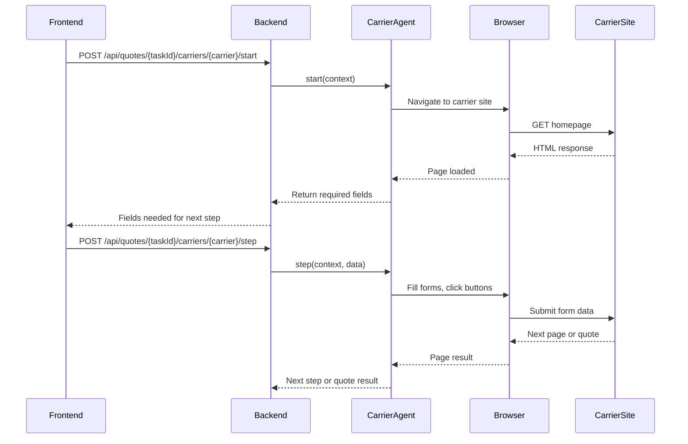

# GoldyQuote Architecture Documentation

## Overview

GoldyQuote uses a modern microservices-inspired architecture with a React frontend and Node.js backend, leveraging Playwright for browser automation. The system is designed for scalability, maintainability, and extensibility.

## 🏗️ System Architecture

```
┌─────────────────┐    WebSocket    ┌─────────────────┐    Playwright    ┌─────────────────┐
│                 │◄───────────────►│                 │◄────────────────►│                 │
│  React Frontend │     HTTP/REST   │  Express Server │    Browser API   │   Chrome Browser│
│                 │◄───────────────►│                 │                  │                 │
└─────────────────┘                 └─────────────────┘                  └─────────────────┘
         │                                   │                                     │
         │                                   │                                     │
         ▼                                   ▼                                     ▼
┌─────────────────┐                 ┌─────────────────┐                  ┌─────────────────┐
│   User Data     │                 │  Task Manager   │                  │  Multiple Tabs  │
│   Collection    │                 │   User Cache    │                  │ ┌─────┬─────┬───┤
│     Forms       │                 │   Validation    │                  │ │GEICO│PROG │SF │
└─────────────────┘                 └─────────────────┘                  │ └─────┴─────┴───┤
                                             │                           │ │    LM         │
                                             ▼                           │ └───────────────┘
                                    ┌─────────────────┐                  └─────────────────┘
                                    │ Carrier Agents  │
                                    │ ┌─────────────┐ │
                                    │ │BaseCarrier  │ │
                                    │ │   Agent     │ │
                                    │ └─────────────┘ │
                                    │        △        │
                                    │        │        │
                                    │ ┌──────┴──────┐ │
                                    │ │Geico│Prog│SF│ │
                                    │ │Agent│Agent│..│ │
                                    │ └─────┴─────┴──┘ │
                                    └─────────────────┘
```

## 🧠 Core Components

### Frontend (`src/`)

**Technology Stack:**
- React 18 with TypeScript
- Tailwind CSS for styling
- React Router for navigation
- WebSocket client for real-time updates

**Key Components:**
- **Data Collection Forms**: Unified forms that collect all required data once
- **Progress Tracking**: Real-time updates via WebSocket connection
- **Quote Comparison**: Side-by-side comparison of quotes from multiple carriers
- **Responsive Design**: Mobile-first approach with desktop optimization

### Backend (`server/src/`)

**Technology Stack:**
- Node.js 18+ with Express.js
- TypeScript for type safety
- Playwright for browser automation
- WebSocket server for real-time communication

**Core Services:**

#### 1. Task Manager (`services/TaskManager.ts`)
- **Purpose**: Centralized task and data management
- **Responsibilities**:
  - Generate unique task IDs
  - Cache user data across carriers
  - Validate input data
  - Coordinate multi-carrier workflows
  - Cleanup old tasks

```typescript
interface TaskState {
  taskId: string;
  carrier: string;
  status: 'initializing' | 'waiting_for_input' | 'processing' | 'completed' | 'error';
  currentStep: number;
  requiredFields: Record<string, FieldDefinition>;
  userData: Record<string, any>;
  createdAt: Date;
  lastActivity: Date;
}
```

#### 2. Browser Manager (`browser/BrowserManager.ts`)
- **Purpose**: Efficient browser resource management
- **Key Features**:
  - Single browser instance for all tasks
  - Multiple browser contexts for isolation
  - Chrome stable channel usage (no bundled Chromium)
  - Automatic cleanup and resource management
  - Context-per-task isolation

```typescript
class BrowserManager {
  private browser: Browser | null;
  private contexts: Map<string, { context: BrowserContext; page: Page }>;
  
  async getBrowserContext(taskId: string): Promise<{ context: BrowserContext; page: Page }>;
  async closePage(taskId: string): Promise<void>;
  async cleanup(): Promise<void>;
}
```

#### 3. Carrier Agents (`agents/`)
- **Purpose**: Insurance carrier-specific automation
- **Architecture**: Base class with carrier-specific implementations
- **Supported Carriers**: GEICO, Progressive, State Farm, Liberty Mutual

## 🤖 Carrier Agent System

### Base Carrier Agent

The `BaseCarrierAgent` provides common functionality for all insurance carriers:

```typescript
abstract class BaseCarrierAgent implements CarrierAgent {
  abstract readonly name: string;
  protected tasks: Map<string, TaskState> = new Map();

  // Abstract methods that must be implemented
  abstract start(context: CarrierContext): Promise<CarrierResponse>;
  abstract step(context: CarrierContext, stepData: Record<string, any>): Promise<CarrierResponse>;

  // Common methods available to all agents
  async status(taskId: string): Promise<TaskStatus>;
  async cleanup(taskId: string): Promise<CleanupResult>;
  
  // Protected helper methods
  protected createTask(taskId: string, carrier: string): TaskState;
  protected updateTask(taskId: string, updates: Partial<TaskState>): TaskState;
  protected getBrowserPage(taskId: string): Promise<Page>;
  protected takeScreenshot(page: Page, filename: string): Promise<string>;
  protected fillFormFields(page: Page, formData: Record<string, any>, fieldMappings: Record<string, string>): Promise<void>;
}
```

### Carrier-Specific Implementation

Each carrier agent extends the base agent:

```typescript
export class GeicoAgent extends BaseCarrierAgent {
  readonly name = 'geico';

  async start(context: CarrierContext): Promise<CarrierResponse> {
    // Navigate to GEICO website
    // Analyze initial page
    // Return required fields
  }

  async step(context: CarrierContext, stepData: Record<string, any>): Promise<CarrierResponse> {
    // Process step based on current page type
    // Fill forms with user data
    // Handle navigation and validation
    // Return next step or completion
  }

  private async handleZipCodeStep(page: Page, context: CarrierContext, stepData: Record<string, any>): Promise<CarrierResponse> {
    // GEICO-specific ZIP code handling
  }

  private async handlePersonalInfoStep(page: Page, context: CarrierContext, stepData: Record<string, any>): Promise<CarrierResponse> {
    // GEICO-specific personal info handling
  }
}
```

## 🎭 Playwright Integration

### Why Playwright over Puppeteer?

1. **Better Reliability**: More robust selectors and waiting mechanisms
2. **Modern API**: Better async/await support and error handling
3. **Cross-browser Support**: Easy to extend to Firefox and Safari
4. **Built-in Testing**: Integrated testing framework
5. **Active Development**: More frequent updates and improvements

### Browser Management Strategy

```typescript
// Single browser instance shared across all tasks
const browser = await chromium.launch({
  channel: 'chrome',  // Use system Chrome
  headless: !config.headful
});

// Each task gets its own context for isolation
const context = await browser.newContext({
  viewport: { width: 1280, height: 720 },
  userAgent: 'Mozilla/5.0 (Macintosh; Intel Mac OS X 10_15_7) AppleWebKit/537.36'
});

const page = await context.newPage();
```

### Locator Strategy

The system uses Playwright's modern locator approach:

```typescript
class LocatorHelpers {
  // Semantic locators (preferred)
  getByLabel(text: string): Locator;
  getByRole(role: string): Locator;
  getByPlaceholder(text: string): Locator;
  
  // Fallback locators
  getByFieldName(name: string): Locator;
  getByFieldId(id: string): Locator;
  
  // Carrier-specific helpers
  getZipCodeField(): Locator;
  getStartQuoteButton(): Locator;
  getContinueButton(): Locator;
}
```

## 🔄 Data Flow

### 1. Unified Data Collection



### 2. Carrier Automation



## 📊 State Management

### Task States

```typescript
type TaskStatus = 
  | 'initializing'      // Task created, browser starting
  | 'waiting_for_input' // Waiting for user data
  | 'processing'        // Automating carrier site
  | 'completed'         // Quote obtained
  | 'error'            // Error occurred
  | 'inactive';        // Task cleaned up
```

### Data Validation

```typescript
interface FieldDefinition {
  id: string;
  name: string;
  type: 'text' | 'email' | 'tel' | 'date' | 'select' | 'radio' | 'checkbox' | 'number';
  options?: string[];
  required: boolean;
  validation?: {
    pattern?: string;
    min?: number;
    max?: number;
    minLength?: number;
    maxLength?: number;
  };
}
```

## 🔧 Configuration Management

### Environment Variables

```typescript
export const config = {
  port: process.env.PORT || 3001,
  nodeEnv: process.env.NODE_ENV || 'development',
  
  // Browser settings
  headful: process.env.HEADFUL === '1',
  browserTimeout: parseInt(process.env.BROWSER_TIMEOUT || '60000', 10),
  stepTimeout: parseInt(process.env.STEP_TIMEOUT || '15000', 10),
  
  // Directories
  screenshotsDir: process.env.SCREENSHOTS_DIR || './screenshots',
};
```

### Runtime Configuration

- **Development**: Headful browser, verbose logging, hot reload
- **Testing**: Headless browser, fixture data, isolated tests
- **Production**: Headless browser, minimal logging, health checks

## 🧪 Testing Strategy

### Test Types

1. **Unit Tests**: Individual component testing
2. **Integration Tests**: API endpoint testing  
3. **E2E Tests**: Full workflow testing with Playwright
4. **Performance Tests**: Browser automation efficiency
5. **Security Tests**: Input validation and sanitization

### Test Structure

```
server/tests/
├── e2e/
│   ├── multi-carrier.spec.ts    # Multi-carrier workflow tests
│   ├── geico.spec.ts           # GEICO-specific tests
│   ├── progressive.spec.ts     # Progressive-specific tests
│   └── api.spec.ts             # API endpoint tests
├── fixtures/
│   ├── userData.json           # Test user data
│   ├── mockResponses.json      # Mock API responses
│   └── pageFixtures.html       # HTML page fixtures
└── setup/
    ├── global-setup.ts         # Test environment setup
    └── global-teardown.ts      # Test cleanup
```

### Mock Carrier Strategy

For testing, we use mock carrier sites that simulate real insurance websites:

```typescript
// Test fixture with realistic HTML structure
const mockGeicoPage = `
<html>
  <body>
    <form id="quote-form">
      <input name="POL_ratedZip5" placeholder="ZIP Code" />
      <button type="submit">Start My Quote</button>
    </form>
  </body>
</html>
`;
```

## 🚀 Deployment Architecture

### Development
- Local Node.js processes
- System Chrome browser
- File-based screenshots
- In-memory task storage

### Production
- Docker containers
- Kubernetes orchestration
- Shared storage for screenshots
- Redis for task caching (future enhancement)

### Docker Strategy

```dockerfile
# Multi-stage build for efficiency
FROM node:18-slim AS builder
COPY package*.json ./
RUN pnpm install --frozen-lockfile
COPY . .
RUN pnpm run build

FROM node:18-slim AS runtime
# Install system Chrome
RUN apt-get update && apt-get install -y google-chrome-stable
# Copy built application
COPY --from=builder /app/dist ./dist
# Health checks and monitoring
HEALTHCHECK CMD curl -f http://localhost:3001/api/health
```

## 🔒 Security Considerations

### Browser Security
- Isolated browser contexts per task
- No persistent browser data
- Headless mode in production
- Resource limits and timeouts

### Data Security
- Input validation on all endpoints
- No persistent user data storage
- Memory-only task caching
- Secure environment variable handling

### Network Security
- HTTPS enforcement in production
- CORS configuration
- Rate limiting on API endpoints
- Request size limits

## 📈 Performance Optimizations

### Browser Efficiency
- Single browser instance reduces memory usage
- Context pooling for faster task creation
- Intelligent page waiting strategies
- Screenshot compression

### Data Processing
- Lazy loading of carrier agents
- Efficient field mapping algorithms
- Memory cleanup of completed tasks
- WebSocket connection pooling

### Monitoring
- Health check endpoints
- Resource usage metrics
- Error rate tracking
- Performance timing logs

## 🔮 Future Enhancements

### Planned Features
1. **Additional Carriers**: Allstate, Farmers, AAA
2. **Advanced Caching**: Redis for distributed caching
3. **Quote Comparison**: AI-powered recommendation engine
4. **Mobile App**: React Native application
5. **Analytics**: User behavior and conversion tracking

### Technical Improvements
1. **Microservices**: Split into carrier-specific services
2. **Message Queue**: Async task processing with Bull/Redis
3. **Database**: Persistent storage for quotes and user preferences
4. **API Gateway**: Rate limiting and authentication
5. **Monitoring**: APM integration with DataDog/New Relic

---

This architecture provides a solid foundation for scalable, maintainable, and extensible insurance quote automation. The modular design allows for easy addition of new carriers while maintaining performance and reliability. 