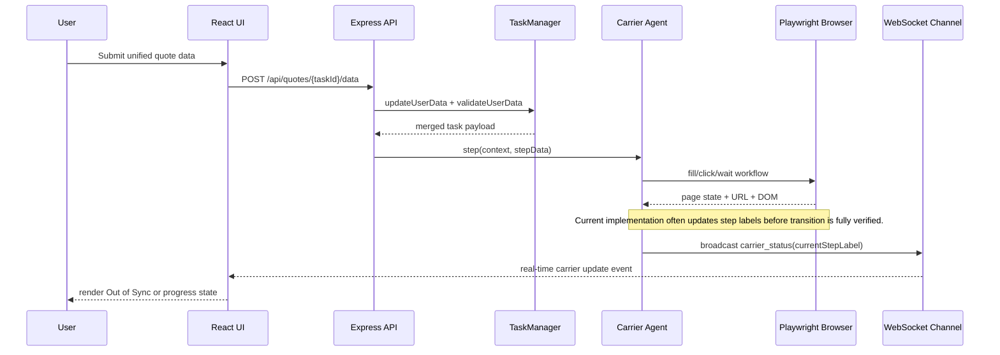

# GoldyQuote – Context Summary (2026-03-31)

This document captures the complete current development context for the multi-carrier browser automation strategy so future implementation work can resume quickly and consistently.

## Session Addendum (2026-04-01)

- Manual MCP verification was re-run twice using the deterministic low-timeout scenario from `docs/ui-testing-mcp.md`:
  - `STEP_TIMEOUT=300` with task `task_1775004311146_nhl3wqg`
  - `STEP_TIMEOUT=150` with task `task_1775004396188_yxk217q`
- Both runs reached live quote-form processing states and carrier cards advanced (`26%` to `42%`, status text "Starting quote process..." then "Filling application forms..."), but no visible `Stalled` badge was captured.
- Frontend console evidence showed repeated WebSocket reconnect churn in required-fields/snapshot hooks during these runs, which is now the primary suspected blocker to stable manual stalled-badge observation.

## 1. Title & Date

**Session Date:** 2026-03-31

GoldyQuote is currently focused on hardening an advanced automation strategy that can reliably traverse multiple insurance carrier websites across many pages and return quote-ready results while preserving a unified frontend workflow.

## 2. Architectural Goal

The current architectural goal is to turn the existing multi-carrier automation from a mostly best-effort navigation engine into a deterministic, state-aware workflow that remains reliable under real-world carrier drift. GoldyQuote already has the core building blocks: a React frontend for a unified quote wizard, an Express backend for orchestration, Playwright-driven browser automation, and WebSocket-based status streaming. The immediate objective is to make carrier agents resilient when pages re-render, route through single-page app transitions, trigger dynamic modals, or silently reload to earlier steps.

From a business and user perspective, this matters because the product promise depends on reducing repetitive form filling and providing confidence that each carrier is progressing correctly. If agents backtrack or stall, users lose trust, the comparison outcome is delayed or incomplete, and support/debug costs rise quickly. The near-term target is to enforce verified step transitions, improve page-state detection, surface stalled states in real time, and normalize completion criteria so a quote is only marked complete when evidence is strong. In short: deterministic automation, transparent observability, and user-visible synchronization between backend progress and frontend step context.

## 3. Change Log

| Commit / PR ID | Layer | Filepath | +/- LOC | One-line description |
|---|---|---|---|---|
| `8159e06` | Backend types | `server/src/types/index.ts` | `+16` | Added `currentStepLabel` support to task and status message contracts. |
| `8159e06` | Agent core | `server/src/agents/BaseCarrierAgent.ts` | `+10` | Included `currentStepLabel` in primary and fallback WebSocket `carrier_status` broadcasts. |
| `c24f01c` | Carrier: GEICO | `server/src/agents/geicoAgent.ts` | `+3` | Added label emissions for `date_of_birth`, `name_collection`, and `address_collection`. |
| `0571f68` | Carrier: Progressive | `server/src/agents/progressiveAgent.ts` | `+6` | Added progressive step labels `personal_info`, `address_info`, `vehicle_info`, `driver_details`. |
| `0571f68` | Carrier: Liberty Mutual | `server/src/agents/libertyMutualAgent.ts` | `+1` | Added initial step label `personal_info` to status updates. |
| `0571f68` | Carrier: State Farm | `server/src/agents/stateFarmAgent.ts` | `+1` | Added initial step label `personal_info` to status updates. |
| `3a140e0` | Frontend hook | `src/hooks/useRequiredFieldsWebSocket.ts` | `+7/-1` | Exposed backend-provided `currentStepLabel` in frontend WebSocket state. |
| `c945574` | Frontend workflow | `src/components/quotes/MultiCarrierQuoteForm.tsx` | `N/A` | Added step-label drift detection and carrier out-of-sync signaling in wizard logic. |
| `c945574` | Frontend UI | `src/components/quotes/CarrierStatusCard.tsx` | `N/A` | Added red Out of Sync badge to carrier status card presentation. |
| `working-tree` | Agent core | `server/src/agents/BaseCarrierAgent.ts` | `+~90` | Added guarded step transition verifier and `carrier_stalled` emission helper. |
| `working-tree` | Carrier: GEICO | `server/src/agents/geicoAgent.ts` | `+~20/-~10` | Replaced optimistic label advancement with transition-verified advancement on key steps. |
| `working-tree` | Carrier: Progressive | `server/src/agents/progressiveAgent.ts` | `+~30/-~15` | Replaced optimistic label advancement with transition-verified advancement on key steps. |
| `working-tree` | Backend types | `server/src/types/index.ts` | `+~12` | Added `CarrierStalledMessage` and included it in WebSocket message union. |
| `working-tree` | Frontend websocket hook | `src/hooks/useRequiredFieldsWebSocket.ts` | `+~20` | Added `carrier_stalled` payload type and callback routing in live socket listener. |
| `working-tree` | Frontend workflow/UI | `src/components/quotes/MultiCarrierQuoteForm.tsx`, `src/components/quotes/CarrierStatusCard.tsx` | `+~30` | Added stalled-state badge/reason handling and reset logic when carrier status recovers. |
| `working-tree` | Documentation | `docs/context_summary_2026-03-31.md` | `rewrite` | Rebuilt context summary with strategy analysis and next-execution roadmap. |

## 4. Deep-Dive Highlights

The most important backend code path remains the base agent task update and broadcast flow. In `BaseCarrierAgent`, every status update flows through `updateTask`, which merges task state and emits `carrier_status` over WebSocket. This centralization is good because the frontend receives one canonical stream for `status`, `currentStep`, and `currentStepLabel`. However, the current weakness is semantic timing: many carrier handlers set the next step immediately after a click rather than after proving the browser truly reached that next state. That allows false advancement and later regression when carrier pages redirect, hydrate late, or invalidate an earlier action.

Session continuation added a shared transition gate in `BaseCarrierAgent` (`verifyStepTransitionAndAdvance`) that verifies expected step label + page movement before advancing `currentStepLabel`. If a transition does not progress within timeout, the backend now emits `carrier_stalled` with expected/detected label and URL context. GEICO and Progressive handlers were wired to use this gate for key transitions where label advancement previously happened optimistically right after click.

```119:149:server/src/agents/BaseCarrierAgent.ts
      const statusMessage: CarrierStatusMessage = {
        type: 'carrier_status',
        taskId: updatedTask.taskId,
        carrier: updatedTask.carrier,
        status: updatedTask.status,
        currentStep: updatedTask.currentStep,
        currentStepLabel: updatedTask.currentStepLabel,
        version: getPayloadVersion(),
        ...(shouldIncludeRequiredFields() && {
          requiredFields: this.sanitizeRequiredFieldsForBroadcast(updatedTask.requiredFields)
        })
      };
```

Progressive currently has the strongest URL-based step detection and broad continue-selector coverage, but still performs optimistic transitions. Its `identifyCurrentStep` function maps URL/title patterns to step labels, and `clickContinueButton` attempts multiple selectors with short waits. This improves compatibility with changing Progressive markup, yet verification is still too weak for guaranteed progression in client-side routing scenarios where URL can remain stable while content updates.

```105:125:server/src/agents/progressiveAgent.ts
  private async identifyCurrentStep(page: Page): Promise<string> {
    const url = page.url().toLowerCase();
    if (url.includes('nameedit')) return 'personal_info';
    if (url.includes('addressedit')) return 'address_info';
    if (url.includes('vehiclesalledit')) return 'vehicle_info';
    if (url.includes('driversaddpnidetails') || url.includes('driversindex')) return 'driver_details';
    if (url.includes('finaldetailsedit')) return 'final_details';
    if (url.includes('bundle')) return 'bundle_options';
    if (url.includes('rates') || url.includes('quote')) return 'quote_results';
```

GEICO is the clearest regression risk because step detection still relies heavily on raw body-text phrases. Copy changes, localization, A/B tests, or hidden template text can produce false positives. Combined with immediate `currentStepLabel` updates after click, this creates the exact backtracking symptom observed in manual QA: status says progression happened, while the page eventually reflects a prior gate.

```183:203:server/src/agents/geicoAgent.ts
  private async identifyCurrentStep(page: Page): Promise<string> {
    const content = await page.textContent('body') || '';
    if (content.includes('Date of Birth') || content.includes('When were you born')) {
      return 'date_of_birth';
    }
    if (content.includes('Tell us about yourself') && (content.includes('First Name') || content.includes('Last Name'))) {
      return 'name_collection';
    }
    if (content.includes('address') || content.includes('Address')) {
      return 'address_collection';
    }
    return 'unknown';
  }
```

Browser infrastructure is promising: `BrowserManager` isolates per-task contexts and emits automatic navigation snapshots, which is crucial for debugging multi-page drift and providing user-visible progress artifacts. `BrowserActions` also contains poisoned-context recovery logic and URL restoration. The unresolved gap is policy: there is no explicit stalled-state detector that escalates when a carrier remains at one label too long while processing. Without this, both backend and frontend can appear healthy even when flow advancement has silently stopped.

That stalled-state gap is now partially closed in this session. Backend emits `carrier_stalled` and frontend hook/UI consume it with a visible `Stalled` badge and reason text on `CarrierStatusCard`. Recovery behavior clears stalled state on subsequent healthy `carrier_status` updates. Manual MCP validation confirmed quote flow progression from landing page → carrier selection → quote wizard step advancement (personal info to address), and no regressions in baseline interaction. Full end-to-end stalled-event reproduction remains pending because triggering a deterministic transition timeout requires a deeper, longer carrier run.

Security and reliability edge cases to monitor include selector ambiguity (clicking wrong visible element), stale references after SPA transitions, hidden modal overlays swallowing clicks, and marking quote completion based on weak price selectors. A robust terminal-state validator should require URL/signature confirmation plus parseable premium and evidence screenshot before `completed`.

## 5. Data-Flow / Sequence Diagram



## 6. Label & Schema Reference

### 6.1 Step Labels and Meanings

| Label | Carrier(s) | Description |
|---|---|---|
| `date_of_birth` | GEICO | Early personal gate asking date of birth before broader identity fields. |
| `name_collection` | GEICO | Name collection step with first/last name inputs. |
| `address_collection` | GEICO | Address entry stage before deeper quote data. |
| `personal_info` | Progressive, Liberty, State Farm | Initial personal details step (name, date of birth, optional email). |
| `address_info` | Progressive | Address form stage (street, apt/suite, city). |
| `vehicle_info` | Progressive, State Farm | Vehicle data stage (year/make/model and related fields). |
| `driver_details` | Progressive, State Farm | Driver profile and risk-history data stage. |
| `final_details` | Progressive | Final policy/profile details prior to bundling or quote display. |
| `bundle_options` | Progressive | Offer step for auto-only vs bundled options. |
| `quote_results` | Progressive (target), State Farm (target), Liberty (target), GEICO (target) | Terminal quote presentation state when premium can be extracted and validated. |

### 6.2 Event Payload and Task-State Fields

| Contract Element | Source | Purpose |
|---|---|---|
| `type: "carrier_status"` | Backend WebSocket | Primary event for per-carrier progress updates. |
| `taskId` | Backend task model | Correlates a status update with one orchestration run. |
| `carrier` | Agent identifier | Distinguishes GEICO/Progressive/StateFarm/Liberty streams. |
| `status` | `TaskState.status` | Lifecycle phase (`initializing`, `waiting_for_input`, `processing`, `completed`, `error`). |
| `currentStep` | `TaskState.currentStep` | Numeric index used by parts of backend/frontend flow control. |
| `currentStepLabel` | `TaskState.currentStepLabel` | Semantic step identity used for synchronization and drift detection. |
| `requiredFields` | Optional payload | Dynamic field requirements when input is needed. |

### 6.3 Backend ↔ Frontend Cross-Reference Matrix

| Backend Signal | Frontend Consumer | Intended UX Behavior | Current Gap |
|---|---|---|---|
| `carrier_status.currentStepLabel` | `useRequiredFieldsWebSocket` | Keep wizard and automation step contexts aligned per carrier. | Can miss regressions if labels oscillate quickly. |
| `carrier_status.status` | Carrier status cards | Show active, waiting, completed, or error state. | No explicit stalled status today. |
| `automation.snapshot` | Snapshot timeline/panels | Provide visual proof of progression and debugging context. | Not fully tied to transition validation logic. |
| `quote_completed` | Quote results panels | Render final premium and coverage details. | Completion confidence depends on selector robustness. |

## 7. Outstanding Work & Next Tasks

1. **P0 – Implement transition verification gates (Owner: Backend agent workstream)**
   - Add a `verifyTransition(fromLabel, toLabel)` helper in `BaseCarrierAgent`.
   - Require URL or DOM signature confirmation before `updateTask` advances label.
   - Introduce one retry path with alternate selectors before declaring failure.

2. **P0 – Add stalled-state detection and escalation (Owner: Backend + Frontend integration)**
   - Emit `carrier_stalled` when `processing` exceeds threshold without label movement.
   - Display stalled badge distinct from Out of Sync in `CarrierStatusCard`.
   - Attach latest snapshot reference in stalled payload for rapid debugging.

3. **P1 – Build per-carrier step signature registry (Owner: Carrier automation team)**
   - Define required/forbidden DOM markers and URL regex for each label.
   - Replace text-only heuristics in GEICO with signature-based detection.
   - Expand Liberty and State Farm label coverage beyond `personal_info`.

4. **P1 – Harden quote terminal validation (Owner: Carrier extraction + QA)**
   - Require quote-page signature, parseable premium, and screenshot evidence before `completed`.
   - Add fallback extraction selectors by carrier and confidence scoring.
   - Fail gracefully to `quote_results_pending_validation` instead of false completion.

5. **P2 – Expand deterministic QA scenarios (Owner: QA automation)**
   - Add manual MCP test scripts for intentional drift and delayed navigation.
   - Record traces/screenshots for first two transitions per carrier.
   - Add regression checklist entry for backtracking from step 2 to step 0.

## 8. Decision Log

- **Decision**: Use `currentStepLabel` as the canonical synchronization signal between backend and frontend. **Rationale**: Numeric steps diverge across carrier flows and cannot reliably represent semantic stage parity. **Alternatives**: Keep numeric-only steps; infer semantics only in frontend; carrier-specific hardcoded UI adapters.
- **Decision**: Keep a shared `BaseCarrierAgent` broadcast/update pipeline instead of carrier-specific emitters. **Rationale**: Centralized status publication reduces payload drift and enforces one contract surface for UI consumers. **Alternatives**: Let each agent emit bespoke events; route all updates through `TaskManager`; poll-only frontend model.
- **Decision**: Maintain per-task isolated browser contexts and automatic snapshot events. **Rationale**: Isolation reduces cross-carrier contamination and snapshots materially improve forensic debugging of redirect/modals/regressions. **Alternatives**: Shared context per carrier; screenshots only on failures; no automatic snapshot broadcasting.
- **Decision**: Preserve mixed selector strategies temporarily while migrating to stronger state verification. **Rationale**: Full selector unification in one pass is high risk and may block immediate regression fixes. **Alternatives**: Immediate full rewrite; freeze all carrier changes until one resolver is complete; remove dynamic discovery and use strict hardcoded selectors only.

## 9. Risks & Mitigations

| Risk Type | Risk | Impact | Mitigation |
|---|---|---|---|
| Technical | Optimistic step updates create false progression and hidden regressions. | User sees misleading progress; quote completion probability drops. | Gate all step transitions behind verifiable URL/DOM signatures and retries. |
| Technical | Carrier DOM changes break fragile selectors and text-only heuristics. | Frequent agent failures, increased maintenance overhead. | Build selector registry with layered fallback and per-carrier signature tests. |
| Technical | No explicit stalled-state handling in status model. | Long-running silent failures and poor UX transparency. | Add `carrier_stalled` event, timeout watchdog, and frontend visualization. |
| Schedule | Multi-carrier refactor scope can grow quickly across four distinct flows. | Delivery slips and partial rollout risk. | Phase rollout: Progressive + GEICO first, then Liberty + State Farm. |
| Security | Potentially unsafe file serving if screenshot path constraints regress. | Path traversal or unintended file exposure risk. | Keep basename sanitization, add strict extension allowlist, and reject path separators. |
| Security | Sensitive data in screenshots/logs can leak in non-dev handling. | Privacy/compliance concerns for personally identifiable information. | Redact logs, define retention policy, and restrict screenshot visibility/expiry. |

## 10. Appendix

### 10.1 Reference Links

- [Project README](README.md)
- [Architecture Overview](architecture.md)
- [Testing Guide](testing-guide.md)
- [UI Testing via MCP](ui-testing-mcp.md)
- [Browser Automation Standards 2025](browser-automation-standards-2025.md)
- [Browser Automation Antipatterns](browser-automation-antipatterns.md)

### 10.2 Glossary

| Term | Meaning |
|---|---|
| **SPA** | Single-Page Application; a web app that updates content without full page reloads. |
| **DOM** | Document Object Model; the browser representation of page structure. |
| **CDP** | Chrome DevTools Protocol; remote control protocol for Chrome-based automation. |
| **MCP** | Model Context Protocol; tool bridge used for structured IDE/browser integrations. |
| **PII** | Personally Identifiable Information, such as name, address, date of birth, email. |
| **WebSocket** | Persistent bi-directional connection used for real-time carrier status events. |
| **Step Label** | Semantic string identifier (for example `address_info`) describing automation stage. |
