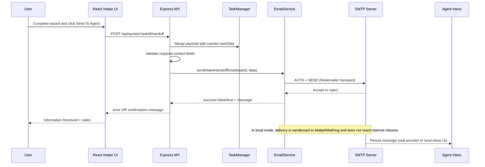

# GoldyQuote – Context Summary (2026-04-06)

This file captures the full state of the v1 intake-handoff pivot so follow-on agents can resume implementation, testing, and production-hardening without re-discovery.

## 1. Title & Date

- **Date:** 2026-04-06
- **Scope:** v1 no-comparison intake flow, SMTP handoff delivery, local SMTP testing path, and guardrail rules

## 2. Architectural Goal

The current architectural goal is to complete a pragmatic v1 path where the frontend collects structured insurance intake data, the backend validates essential contact fields, and the system hands the data to a human agent via email with deterministic confirmation UX. This intentionally replaces direct multi-carrier quote automation as the primary user promise for this stage, reducing execution risk while preserving business momentum. Users now move from landing page intake directly into a unified wizard, then submit once and receive a clear confirmation state with a follow-up video.

This matters because it lowers operational complexity and improves reliability at a critical phase: the business can start handling real demand with human follow-up while automation reliability matures in parallel. It also aligns with cost constraints by enabling local SMTP testing (MailHog/Mailpit) and avoiding mandatory paid vendors during development. The architecture now emphasizes: (1) clear routing and copy that reflects intake rather than comparison, (2) backend handoff endpoint validation for minimum lead quality, (3) configurable outbound recipient/sender behavior through environment variables, and (4) manual browser validation through MCP before production SMTP cutover.

## 3. Change Log

| Commit / PR ID | Layer | Filepath | +/- LOC | One-line description |
|---|---|---|---|---|
| `25bd2d8` | Backend API | `server/src/index.ts` | `+119/-0` | Added v1 handoff endpoint and media serving route for confirmation video flow. |
| `25bd2d8` | Backend service | `server/src/services/emailService.ts` | `+91/-0` | Added SMTP email handoff service with validation and plain-text payload formatting. |
| `25bd2d8` | Frontend form | `src/components/quotes/MultiCarrierQuoteForm.tsx` | `+217/-156` | Replaced quote-return completion with submit-to-agent handoff and confirmation UI. |
| `25bd2d8` | Backend deps | `server/package.json` | `+2/-0` | Added nodemailer dependency support for SMTP delivery. |
| `working-tree` | Frontend routing | `src/App.tsx`, `src/pages/QuoteFormPage.tsx` | `+8/-66` | Removed comparison path usage and aligned page heading/routing for intake-only flow. |
| `working-tree` | Frontend marketing copy | `src/components/home/HeroSection.tsx` | `+28/-7` | Updated start action to `POST /api/intake/start` and intake-first CTA copy. |
| `working-tree` | Frontend sections | `src/components/home/CTASection.tsx`, `FeaturesSection.tsx`, `HowItWorksSection.tsx`, `TestimonialsSection.tsx`, `Footer.tsx` | `+28/-28` | Removed comparison-oriented phrasing and aligned messaging to agent handoff. |
| `working-tree` | Configurable email recipient | `server/src/services/emailService.ts` | `+7/-2` | Introduced `HANDOFF_EMAIL_TO` override with fallback recipient behavior. |
| `working-tree` | Dev tooling | `package.json`, `scripts/start-mailhog.sh`, `scripts/stop-mailhog.sh` | `+62/-0` | Added local SMTP helper scripts (`dev:mailhog`) with Docker MailHog and Homebrew Mailpit support. |
| `working-tree` | Ops docs + env examples | `server/.env.example`, `docs/mailhog-local-smtp-testing.md` | `+91/-0` | Added local SMTP runbook and example env values for zero-cost end-to-end testing. |
| `working-tree` | SMTP provider cutover | `server/.env`, `server/.env.example` | `+14/-6` | Switched runtime SMTP target from local Mailpit/MailHog to Brevo relay template/config. |
| `working-tree` | Rule governance | `.cursor/rules/rule.mdc` | `+14/-4` | Added always-apply guardrails for manual MCP testing and self-hosted/free-tier preference. |
| `working-tree` | Progress tracking | `docs/v1-intake-handoff-progress.md` | `+17/-4` | Recorded pivot details, SMTP findings, and local test workflow updates. |

## 4. Deep-Dive Highlights

The most critical backend path is now the handoff endpoint lifecycle in `server/src/index.ts`, where request payload merging, required contact validation, and email dispatch happen in one transaction-like flow. The endpoint at `POST /api/quotes/:taskId/handoff` merges incoming `userData` into cached task data, then requires `firstName`, `lastName`, `email`, `phone`, and `zipCode` before continuing. This protects lead quality and prevents empty submissions from creating false operational signals.

```path:215-276:server/src/index.ts
app.post('/api/quotes/:taskId/handoff', async (req, res) => {
  // ... payload merge and field extraction
  if (!firstName || !lastName || !email || !phone || !finalZipCode) {
    return res.status(400).json({
      error: 'Missing required contact fields: firstName, lastName, email, phone, and zipCode are required.',
    });
  }
  const emailResult = await sendIntakeHandoffEmail({ ... });
  if (!emailResult.success) {
    return res.status(500).json({ error: emailResult.message });
  }
  return res.json({
    success: true,
    message: 'Thank you! Your information was received. An agent will be in contact soon.',
    emailSent: true,
  });
});
```

The email service implementation in `server/src/services/emailService.ts` now contains the second high-risk path: environment-gated SMTP setup and dynamic recipient override. Two behavioral details matter: (1) SMTP config is considered invalid unless all five env vars are non-empty, and (2) recipient selection defaults to Megan but can be overridden with `HANDOFF_EMAIL_TO`. This lets teams test with a temporary mailbox without code edits.

```path:18-47:server/src/services/emailService.ts
const requiredEnvVars = ['SMTP_HOST', 'SMTP_PORT', 'SMTP_USER', 'SMTP_PASS', 'SMTP_FROM'] as const;
function isSmtpConfigured(): boolean {
  return requiredEnvVars.every((envVar) => !!process.env[envVar]);
}
function getHandoffRecipient(): string {
  const configuredRecipient = sanitizeValue(process.env.HANDOFF_EMAIL_TO || '');
  return configuredRecipient || DEFAULT_HANDOFF_RECIPIENT;
}
```

Frontend flow integrity is concentrated in the `submitIntakeHandoff` branch of `MultiCarrierQuoteForm`. It sends wizard state to backend handoff, surfaces API errors in-line, and on success flips UI to confirmation mode with the served video asset. This is where the user-visible definition of done now lives for v1.

```path:349-383:src/components/quotes/MultiCarrierQuoteForm.tsx
const submitIntakeHandoff = async () => {
  const response = await fetch(`/api/quotes/${taskId}/handoff`, { ... });
  const result = await response.json();
  if (!response.ok) throw new Error(result?.error || 'Failed to submit intake handoff');
  setHandoffMessage(result?.message || 'Your information has been received...');
  setHandoffComplete(true);
};
```

```path:475-497:src/components/quotes/MultiCarrierQuoteForm.tsx
if (handoffComplete) {
  return (
    <Card className="p-6">
      <h2>Information Received</h2>
      <video src="/api/media/info-received.mp4" controls playsInline preload="metadata" />
    </Card>
  );
}
```

Manual E2E evidence from this session shows two distinct SMTP behaviors: Gmail credentials produced `EAUTH 535 BadCredentials`, while local SMTP (`127.0.0.1:1025`) completed end-to-end and captured a full handoff email in Mailpit (`http://localhost:8025`). This validates form→API→SMTP plumbing and narrows production-risk to provider auth and deliverability configuration.

A noteworthy edge case: local testing still labels `To: micahp@utexas.edu`, but that does not imply internet delivery when Mailpit/MailHog is configured; it is only message metadata inside local inbox capture. Another minor quality issue is email readability: payload currently emits alphabetically sorted raw key names (`firstName`, `liabilityLimit`) rather than grouped, human-friendly sections. No security regressions were introduced, but newline sanitization in email text should remain in place to reduce header/body formatting abuse.

## 5. Data-Flow / Sequence Diagram



## 6. Label & Schema Reference

### 6.1 Runtime Labels / Flags

| Label / Flag | Location | Description |
|---|---|---|
| `handoffComplete` | `MultiCarrierQuoteForm` state | Frontend switch to confirmation UI after successful backend handoff response. |
| `handoffError` | `MultiCarrierQuoteForm` state | User-visible API error string shown under submit control. |
| `emailSent` | Handoff API response payload | Backend success marker indicating SMTP dispatch completed. |
| `HANDOFF_EMAIL_TO` | `server/.env` | Optional recipient override for handoff destination. |
| `SMTP_SECURE` | `server/.env` | Controls transport TLS behavior (`true/1` or inferred by port 465). |

### 6.2 Event / Payload Structures

| Object | Key Fields | Purpose |
|---|---|---|
| `IntakeHandoffEmailParams` | `taskId`, `selectedCarriers`, `userData`, `zipCode`, `insuranceType` | Service contract used to construct outbound handoff email content. |
| Handoff request body | `carriers`, `zipCode`, `insuranceType`, `userData` | Frontend submission payload from final wizard step. |
| Handoff response body | `success`, `message`, `emailSent` | Backend completion contract used by frontend confirmation branch. |

### 6.3 Cross-System Mapping Matrix (Backend ↔ Frontend)

| Backend Source | Frontend Consumer | Mapping Behavior |
|---|---|---|
| `res.json({ message, emailSent })` from `/handoff` | `setHandoffMessage`, `setHandoffComplete(true)` | Drives confirmation copy and terminal state in wizard component. |
| `res.status(500).json({ error })` from `/handoff` | `throw new Error(result.error)` + `setHandoffError` | Renders visible submit-time failure reason for recovery attempts. |
| Env `HANDOFF_EMAIL_TO` / default recipient | N/A (server-side only) | Determines handoff destination without changing frontend behavior. |
| Env `SMTP_*` | N/A (server-side only) | Determines whether transport succeeds, fails auth, or remains unconfigured. |

## 7. Outstanding Work & Next Tasks

1. **P0 — Improve handoff email readability (Owner: Backend)**
   - Group fields into sections (Contact, Address, Vehicle, Driver, Coverage).
   - Replace raw keys with human labels.
   - Add top summary block (name, phone, email, ZIP, insurance type, timestamp).

2. **P0 — Validate Brevo live send path (Owner: Ops/Env + QA)**
   - Set `SMTP_PASS` in `server/.env` to a valid Brevo SMTP key.
   - Run one manual MCP end-to-end submission.
   - Confirm external receipt in `micahp@utexas.edu`.

3. **P1 — Add provider-specific auth diagnostics (Owner: Backend)**
   - Normalize SMTP failures into actionable error classes (`EAUTH`, network timeout, TLS mismatch).
   - Return concise user-safe error message and log provider detail server-side.

4. **P1 — Harden local SMTP helper scripts (Owner: DevEx)**
   - Add explicit status command (`dev:mailhog:status`) for active backend/test runs.
   - Improve startup messaging when Docker daemon is installed but unavailable.

5. **P2 — Content consistency cleanup (Owner: Frontend)**
   - Remove remaining language that implies live quote comparison in secondary pages/components.
   - Add one pass of UX copy QA tied to the v1 intake narrative.

## 8. Decision Log

- **Decision:** Make handoff recipient configurable via env (`HANDOFF_EMAIL_TO`) with fallback default.  
  **Rationale:** Supports fast testing and staged rollout mailbox changes without code churn.  
  **Alternatives:** Hardcode all recipients in service; add DB-configurable recipient registry.

- **Decision:** Adopt local SMTP-first testing path (MailHog/Mailpit) before provider cutover.  
  **Rationale:** Preserves zero-cost development while validating form/API/email behavior deterministically.  
  **Alternatives:** Immediate paid provider integration; mock-only email send with no inbox capture.

- **Decision:** Enforce manual browser validation via MCP and self-hosted/free-tier preference in always-apply rule.  
  **Rationale:** Aligns execution behavior with project constraints and avoids accidental paid-vendor drift.  
  **Alternatives:** Keep informal convention only; enforce via CI scripts instead of Cursor rule.

- **Decision:** Keep v1 UX completion as “information received + follow-up video” rather than quote table output.  
  **Rationale:** Matches current operational reality and reduces false promise risk from unstable automation.  
  **Alternatives:** Continue presenting pseudo-quote completion UI; block launch until full automation parity.

## 9. Risks & Mitigations

| Risk Type | Risk | Impact | Mitigation |
|---|---|---|---|
| Technical | SMTP provider auth mismatches (`EAUTH`) block live sends. | Intake submits fail at final step in production mode. | Add provider checklists, explicit env validation, and error classification with remediation text. |
| Technical | Local SMTP mode mistaken for real delivery. | Team assumes emails reached external inbox when they are sandboxed. | Add startup banner and docs note: local SMTP captures only, no internet delivery. |
| Schedule | Iteration on email format may delay real-provider cutover. | Launch readiness slips while formatting churn continues. | Timebox format pass, then cut over and iterate from live stakeholder feedback. |
| Security | Raw user data appears in email text with broad field set. | Sensitive data exposure risk if mailbox handling is weak. | Minimize fields, redact nonessential values, and enforce mailbox access controls. |
| Security | Misconfigured `SMTP_FROM` domain alignment may fail deliverability checks. | Messages may be rejected/spam-foldered. | Align SPF, DKIM, and domain sender policy before production volume. |
| Cost | Accidental adoption of paid third-party defaults. | Violates project budget constraints. | Keep always-apply rule active; require explicit approval and free alternative analysis. |

## 10. Appendix

### 10.1 Referenced Docs / Artifacts

- `docs/v1-intake-handoff-progress.md`
- `docs/mailhog-local-smtp-testing.md`
- `docs/context_summary_2026-03-31.md`
- `docs/work-task-tracker.md`
- `server/src/index.ts`
- `server/src/services/emailService.ts`
- `src/components/quotes/MultiCarrierQuoteForm.tsx`
- `.cursor/rules/rule.mdc`

### 10.2 Glossary

| Term | Meaning |
|---|---|
| API | Application Programming Interface, the backend endpoints used by the frontend. |
| SMTP | Simple Mail Transfer Protocol, the transport used to send handoff emails. |
| MCP | Model Context Protocol, the tooling channel used for manual browser validation. |
| EAUTH | Authentication error code returned by Nodemailer/SMTP auth flows. |
| TLS | Transport Layer Security, encryption mode used by secure SMTP configurations. |
| UX | User Experience, the visible flow and messaging behavior in the frontend. |
