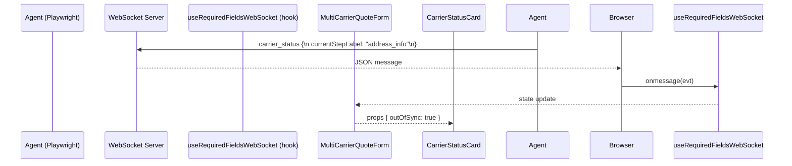

# GoldyQuote – Temp Context Summary (07/08/2025)

> **Purpose**: Persist a rich snapshot of the *entire* working context so that any agent (human or LLM) can resume development without rereading 70 k tokens of chat.  This file is intentionally verbose.

---

## 1. Architectural Goal

Introduce **carrier-side progress synchronisation** so the React multi-carrier wizard can detect when an automated carrier flow drifts out of sync with the user-driven form.  This is achieved by broadcasting a `currentStepLabel` string from the backend agents via WebSocket and consuming it in the front-end.

---

## 2. Backend Changes

| PR | Area | File | Lines | Description |
|----|------|------|-------|-------------|
| 8159e06 | Types | `server/src/types/index.ts` | +16 | Added `currentStepLabel` to `TaskState` & `CarrierStatusMessage`. |
| 8159e06 | Core | `server/src/agents/BaseCarrierAgent.ts` | +10 | Broadcast `currentStepLabel` in both primary & fallback `carrier_status` messages. |
| c24f01c | Geico | `server/src/agents/geicoAgent.ts` | +3 | Emits labels `date_of_birth`, `name_collection`, `address_collection`. |
| 0571f68 | Progressive | `server/src/agents/progressiveAgent.ts` | +6 | Emits labels `personal_info`, `address_info`, `vehicle_info`, `driver_details`. |
| 0571f68 | Liberty | `server/src/agents/libertyMutualAgent.ts` | +1 | Emits label `personal_info` (initial). |
| 0571f68 | StateFarm | `server/src/agents/stateFarmAgent.ts` | +1 | Emits label `personal_info` (initial). |

### 2.1 Label Mapping Reference

| Carrier | Step # | Label | Notes |
|---------|--------|-------|-------|
| Geico | 1 | `date_of_birth` | Single-field page requiring only DOB [[memory:2092807]] |
| Geico | 2 | `name_collection` | First+Last name |
| Geico | 3 | `address_collection` | Street address only |
| Progressive | 1 | `personal_info` | Name, DOB, email |
| Progressive | 2 | `address_info` | Street / Apt / City |
| Progressive | 3 | `vehicle_info` | Repeats per-vehicle subflow |
| Progressive | 4 | `driver_details` | Violations etc. |
| Liberty | 1 | `personal_info` | Combined modal after homepage |
| State Farm | 1 | `personal_info` | Follows ZIP landing page |

*Liberty/StateFarm subsequent labels TBD once detailed step detection is implemented.*

---

## 3. Front-End Changes

| PR | File | Lines | Description |
|----|------|-------|-------------|
| 3a140e0 | `src/hooks/useRequiredFieldsWebSocket.ts` | +7/-1 | Expose `currentStepLabel` in hook state. |

### 3.1 Planned React Data Flow

---

## 4. Outstanding Work *(updated 07/08/2025 17:10)*

### 4.1 frontend-form-sync-check  **✅ Completed – commit c945574**

The React wizard now maintains a carrier-specific mapping of step numbers → labels, listens for live `carrier_status` events via `useRequiredFieldsWebSocket`, and flags each carrier as `outOfSync` when the backend-reported `currentStepLabel` diverges from the user’s current step.

### 4.2 frontend-statuscard-badge **✅ Completed – commit c945574**

`CarrierStatusCard` accepts a new `outOfSync` prop and displays a red “Out of Sync” pill beside the carrier name when flagged.

---

### 4.3 Agent Enhancements (backlog)

* Finish label coverage for Liberty Mutual & State Farm.
* Consider adding `coverage_selection`, `quote_results` labels when flows complete.

### 4.4 QA

* Manual UI test per [docs/ui-testing-mcp.md].
* Assert badge appears when intentionally skipping steps in form vs. automation.

### 4.5 Regression Discovered – Progressive stuck on step 0

*Observation (2025-07-08, manual QA)*
* Latest screenshot `1751938762874-www.progressive.com_auto_.png` shows Progressive still on “Let’s get started” personal-info page (`currentStepLabel` = `personal_info`).
* React wizard is likewise on step 1, **so “Out of Sync” badge did NOT fire**—but automation should have advanced at least to address_info after DOB/name/email was programmatically filled by the agent.
* Indicates a **new bug** in ProgressiveAgent’s start/step logic introduced during label refactor: likely missing `await` on continue action or selector change.

**Action items**
1. Re-run ProgressiveAgent with verbose logging (`DEBUG=agent:progressive*`).
2. Verify `updateTask(...currentStepLabel)` is executed after clickContinueButton.
3. Update `identifyCurrentStep()` URL/title heuristics if Progressive changed paths.
4. Add Playwright trace capture for the first two steps in CI.

---
## 6. Risks & Mitigations *(updated)*

| Risk | Impact | Mitigation |
|------|--------|-----------|
| Progressive automation stalls on initial "personal_info" page (regression) | Quotes never return, UI shows perpetual "Waiting" | Add integration test, fix selector/await bug, ensure out-of-sync badge triggers on **lack of progress** after timeout |

---

*Generated by Cursor AI on 2025-07-08.*